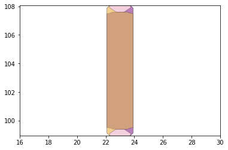
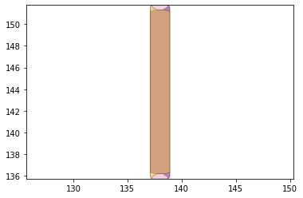

```python
#!pip install shapely==1.7.1 #needed to get right shapely version
```


```python
%matplotlib inline
!pip install foldable_robotics
import foldable_robotics
import foldable_robotics.dxf 
import numpy
import shapely.geometry as sg
from foldable_robotics.layer import Layer
from foldable_robotics.laminate import Laminate
import foldable_robotics.manufacturing
import foldable_robotics.parts.castellated_hinge1
!pip install PyQt5
!pip install pyqtgraph
import idealab_tools.plot_tris
from math import pi, sin,cos,tan
import idealab_tools.text_to_polygons
foldable_robotics.display_height=200
foldable_robotics.line_width=.5

from foldable_robotics.layer import Layer
from foldable_robotics.laminate import Laminate
import foldable_robotics
import foldable_robotics.dxf 
import foldable_robotics.manufacturing
import foldable_robotics.parts.castellated_hinge1
foldable_robotics.display_height=200
foldable_robotics.line_width=.5
!pip install pyBuildWeb

```

    Requirement already satisfied: foldable_robotics in /usr/local/lib/python3.7/dist-packages (0.0.32)
    Requirement already satisfied: numpy in /usr/local/lib/python3.7/dist-packages (from foldable_robotics) (1.21.5)
    Requirement already satisfied: pyyaml in /usr/local/lib/python3.7/dist-packages (from foldable_robotics) (6.0)
    Requirement already satisfied: shapely in /usr/local/lib/python3.7/dist-packages (from foldable_robotics) (1.7.1)
    Requirement already satisfied: idealab-tools in /usr/local/lib/python3.7/dist-packages (from foldable_robotics) (0.0.24)
    Requirement already satisfied: ezdxf in /usr/local/lib/python3.7/dist-packages (from foldable_robotics) (0.17.2)
    Requirement already satisfied: pypoly2tri in /usr/local/lib/python3.7/dist-packages (from foldable_robotics) (0.0.3)
    Requirement already satisfied: matplotlib in /usr/local/lib/python3.7/dist-packages (from foldable_robotics) (3.5.1)
    Requirement already satisfied: pyparsing>=2.0.1 in /usr/local/lib/python3.7/dist-packages (from ezdxf->foldable_robotics) (3.0.7)
    Requirement already satisfied: typing-extensions in /usr/local/lib/python3.7/dist-packages (from ezdxf->foldable_robotics) (4.1.1)
    Requirement already satisfied: imageio in /usr/local/lib/python3.7/dist-packages (from idealab-tools->foldable_robotics) (2.16.1)
    Requirement already satisfied: pillow>=8.3.2 in /usr/local/lib/python3.7/dist-packages (from imageio->idealab-tools->foldable_robotics) (9.1.0)
    Requirement already satisfied: packaging>=20.0 in /usr/local/lib/python3.7/dist-packages (from matplotlib->foldable_robotics) (21.3)
    Requirement already satisfied: python-dateutil>=2.7 in /usr/local/lib/python3.7/dist-packages (from matplotlib->foldable_robotics) (2.8.2)
    Requirement already satisfied: kiwisolver>=1.0.1 in /usr/local/lib/python3.7/dist-packages (from matplotlib->foldable_robotics) (1.4.2)
    Requirement already satisfied: fonttools>=4.22.0 in /usr/local/lib/python3.7/dist-packages (from matplotlib->foldable_robotics) (4.31.2)
    Requirement already satisfied: cycler>=0.10 in /usr/local/lib/python3.7/dist-packages (from matplotlib->foldable_robotics) (0.11.0)
    Requirement already satisfied: six>=1.5 in /usr/local/lib/python3.7/dist-packages (from python-dateutil>=2.7->matplotlib->foldable_robotics) (1.16.0)
    Requirement already satisfied: PyQt5 in /usr/local/lib/python3.7/dist-packages (5.15.6)
    Requirement already satisfied: PyQt5-Qt5>=5.15.2 in /usr/local/lib/python3.7/dist-packages (from PyQt5) (5.15.2)
    Requirement already satisfied: PyQt5-sip<13,>=12.8 in /usr/local/lib/python3.7/dist-packages (from PyQt5) (12.9.1)
    Requirement already satisfied: pyqtgraph in /usr/local/lib/python3.7/dist-packages (0.12.4)
    Requirement already satisfied: numpy>=1.17.0 in /usr/local/lib/python3.7/dist-packages (from pyqtgraph) (1.21.5)
    ERROR: Could not find a version that satisfies the requirement pyBuildWeb (from versions: none)
    ERROR: No matching distribution found for pyBuildWeb
    


```python
import shapely
import sys
m=sys.modules['shapely']
m.__version__

```


    '1.7.1'


```python
import os
import foldable_robotics.solidworks_support
```


```python
def get_bodies(filename, layername, num_layers):
    body = foldable_robotics.dxf.read_lwpolylines(filename,layer=layername, arc_approx = 10)

    bodies = [Layer(sg.Polygon(item)) for item in body]
    body = bodies.pop(0)
    for item in bodies:
        body ^= item
    body = body.to_laminate(num_layers)
    return body
def get_hinge_lines(filename,layername):
    hinge_lines1 = foldable_robotics.dxf.read_lines(filename,layer=layername)
    hinge_lines2 = foldable_robotics.dxf.read_lwpolylines(filename,layer=layername)
    hinge_lines3 = []
    for points in hinge_lines2:
        hinge_lines3.append(points[:2])
    hinge_lines = hinge_lines1 +hinge_lines3
    return hinge_lines
def hinge_lines_to_hinges(hinge_lines,hinge):
    lam = Layer().to_laminate(len(hinge))
    all_hinges = []    
    for p3,p4 in hinge_lines:
        all_hinges.append(hinge.map_line_stretch((0,0),(1,0),p3,p4))
    all_hinges = lam.unary_union(*all_hinges)
    return all_hinges
        
def get_cuts(filename,layername,thickness,num_layers):
    cut_lines = foldable_robotics.dxf.read_lines(filename,layer=layername)
    cut_lines += foldable_robotics.dxf.read_lwpolylines(filename,layer=layername, arc_approx = 10)
    
    cuts = []
    for item in cut_lines:
        cuts.append(Layer(sg.LineString(item)))
    cuts = Layer().unary_union(*cuts)
    cuts<<=thickness/2
    cuts = cuts.to_laminate(num_layers)
    return cuts    
def get_holes(filename, layername,num_layers):
    holes = foldable_robotics.dxf.read_circles(filename,layer='holes')
    
    holes2 = []
    for center, radius in holes:
        holes2.append(sg.Point(*center).buffer(radius))
    holes_layer = Layer(*holes2)
    holes_lam = holes_layer.to_laminate(num_layers)  
    return holes_lam
def hinge_width_calculator(desired_degrees,thickness):
    theta = (180-desired_degrees)*pi/180
    w=thickness/tan(theta)
    return w
def polys_to_layer(l1):
    l1 = [sg.Polygon(item) for item in l1]
    l11 = Layer(l1.pop(0))
    for item in l1:
        l11 ^= Layer(item)
    return l11
    
def output_pdf(filename,design2,x,y,layers_separate = True):
    design2 = design2.translate(x,y)
    design2=design2.scale(1/25.4,1/25.4)
    design2=design2.scale(foldable_robotics.pdf.ppi,foldable_robotics.pdf.ppi)
    if isinstance(design2,Laminate):
        if not layers_separate:
            p=foldable_robotics.pdf.Page(filename+'.pdf')
            for d in design2:
    #        d = design2[0]
                for item in d.exteriors()+d.interiors():
                    p.draw_poly(item)
            p.close()
        else:
            for ii,d in enumerate(design2):
                p=foldable_robotics.pdf.Page(filename+'{0:03f}.pdf'.format(ii))
                for item in d.exteriors()+d.interiors():
                    p.draw_poly(item)
                p.close()

    elif isinstance(design2,Layer):
        p=foldable_robotics.pdf.Page(filename+'.pdf')
        for item in design2.exteriors()+design2.interiors():
            p.draw_poly(item)
        p.close()
        
def build_layer_numbers(num_layers, text_size = None, prop=None):
    text_size = text_size or 1
    prop = prop or {'family':'Arial','size':text_size}
    layer_ids = []
    for ii in range(num_layers): 
    
        l = idealab_tools.text_to_polygons.text_to_polygons('Layer '+str(ii),prop=prop)
        layer_ids.append(l)
    
    layer_ids = [polys_to_layer(item) for item in layer_ids]
    layer_id = Laminate(*layer_ids)
    return layer_id
def build_web(design2,keepout,support_width,jig_diameter,jig_hole_spacing,is_adhesive):
    num_layers = len(design2)

    layer_id = build_layer_numbers(num_layers,text_size=jig_diameter)

    design_outer = foldable_robotics.manufacturing.unary_union(design2)
    bb1= (design_outer<<jig_hole_spacing/2).bounding_box()
    (x1,y1),p2 = bb1.bounding_box_coords()
    w,h = bb1.get_dimensions()
    w2 = round(w/jig_hole_spacing)*jig_hole_spacing
    h2 = round(h/jig_hole_spacing)*jig_hole_spacing
    
    points = []
    points.append(sg.Point(x1,y1))
    points.append(sg.Point(x1+w2,y1))
    points.append(sg.Point(x1,y1+h2))
    points.append(sg.Point(x1+w2,y1+h2))
    
    layer_id = layer_id.translate(x1+jig_diameter,y1-jig_diameter/2)
    placement_holes2 = Layer(*points)
    placement_holes2<<=(jig_diameter/2)
    sheet = (placement_holes2<<10).bounding_box()
    placement_holes2=placement_holes2.to_laminate(num_layers)
    sheet=sheet.to_laminate(num_layers)
    
    removable_scrap = calculate_removable_scrap(design2,sheet,support_width,is_adhesive)
    
    web = (removable_scrap-placement_holes2)-layer_id
    return web,sheet
def calculate_removable_scrap(design,sheet,width,is_adhesive):
    '''this computes all removable scrap given a sheet, a design, and a clearance width'''
    all_scrap = sheet-design

    ru = foldable_robotics.manufacturing.not_removable_up(design,is_adhesive)
    rd = foldable_robotics.manufacturing.not_removable_down(design,is_adhesive)
    
    removable_scrap_up = all_scrap-(ru<<width)
    removable_scrap_down = all_scrap-(rd<<width)

    removable_scrap = removable_scrap_up|removable_scrap_down
    return removable_scrap
```

##Compute 5 Layer Device Design


```python
output_file_name = 'input.dxf'
#this dxf file was produced in autocad2022 as we could not get the .yaml macro to work
```


```python
round_digits = 5
prescale=1000
body_prebuffer=-.01
joint_tolerance = 1e-5

round_digits = 5
prescale=1000
body_prebuffer=-.01
joint_tolerance = 1e-5

round_digits = 2
prescale=1000
jig_diameter = 5
support_width = 1
kerf = .05
jig_hole_spacing=20
is_adhesive = [False,True,False,True,False]
arc_approx = 10
```


```python
hinge = foldable_robotics.parts.castellated_hinge1.generate()
w=hinge_width_calculator(160,0.07)
hinge = hinge.scale(1,w)
hinge.plot()
```


    

    


```python
NUMLAYERS = len(hinge)
body = get_bodies(output_file_name,'body',NUMLAYERS)
body = foldable_robotics.manufacturing.cleanup(body,.02)
body.plot()
```


    

    


```python
joint_lines= get_hinge_lines(output_file_name,'joints')
joints = hinge_lines_to_hinges(joint_lines,hinge)
joints = foldable_robotics.manufacturing.cleanup(joints,.02)
joints.plot()
```


    

    


```python
cuts = get_cuts(output_file_name,'cuts',.02,NUMLAYERS)
#cuts.plot()
holes = get_holes(output_file_name,'holes',NUMLAYERS)
#holes.plot()
hole,dummy = foldable_robotics.manufacturing.calc_hole(joint_lines,w)
hole = hole.to_laminate(NUMLAYERS)
hole<<=.2
hole.plot()
```


    

    


```python
design2 = body- hole - joints - cuts - holes
design2.plot()
```


    

    


```python
keepout =  foldable_robotics.manufacturing.keepout_laser(design2)
keepout = keepout.scale(10,10)
keepout.plot()
```


    

    


```python
design2 = design2.scale(10,10)
design2.plot()
```


    

    


#Compute 5 Layer Manufacturing Geometry


```python
web,sheet=build_web(design2,keepout,support_width,jig_diameter,jig_hole_spacing,is_adhesive)
web.plot()
```

    findfont: Font family ['Arial'] not found. Falling back to DejaVu Sans.
    


    

    


```python
sheet.plot()
```


    

    


```python
second_pass_scrap = sheet - keepout
first_pass_scrap = sheet - design2-second_pass_scrap
first_pass_scrap = foldable_robotics.manufacturing.cleanup(first_pass_scrap,.000001)
first_pass_scrap.plot()

```


    

    


```python
support = foldable_robotics.manufacturing.support(design2,foldable_robotics.manufacturing.keepout_laser,support_width,support_width/2)
support.plot()
```


    

    


```python
#Calculate the web by using only the material which can be cut, minus a gap determined by the support width.  Is that the only material you can use?
supported_design = web|design2|support
supported_design.plot()
```


    

    


```python
#cut_line = keepout<<kerf
cut_material = (keepout<<kerf)-keepout
cut_material.plot()
```


    

    


```python
final_cut = sheet - keepout
final_cut = final_cut[0]
final_cut.plot()
```


    

    


```python
remaining_material = supported_design-cut_material
remaining_material.plot()
```


    

    


```python
remaining_parts = foldable_robotics.manufacturing.find_connected(remaining_material,is_adhesive)
for item in remaining_parts:
    item.plot(new=True)
```

    /usr/local/lib/python3.7/dist-packages/foldable_robotics/laminate.py:91: RuntimeWarning: More than 20 figures have been opened. Figures created through the pyplot interface (`matplotlib.pyplot.figure`) are retained until explicitly closed and may consume too much memory. (To control this warning, see the rcParam `figure.max_open_warning`).
      plt.figure()
    


    

    


    

    


    

    


    

    


    

    


    

    


    

    


    

    


    

    


    

    


    

    


    

    


    

    


    

    


    

    


    

    


    

    


    

    


    

    


    

    


    

    


    

    


    

    


    

    


    

    


    

    


    

    


    

    


    

    


    

    


    

    


    

    


    

    


    

    


    

    


    

    


    

    


    

    


    

    


    

    


    

    


    

    


    

    


    

    


    

    


    

    


    

    


    

    


    

    


    

    


    

    


    

    


    

    


    

    


    

    


    

    


    

    


    

    


    

    


    

    


    

    


    

    


    

    


```python
d3=design2>>1
for item in remaining_parts:
    if not (item&d3).is_null():
        break
item.plot()
```


    

    


```python
check = (item^design2)

check>>=1e-1 #tenth of a mm
check.plot()
check
```

    ('zero-size array to reduction operation minimum which has no identity',)
    


    

    


```python
w,h = supported_design.get_dimensions()
p0,p1 = supported_design.bounding_box_coords()

rigid_layer = supported_design[0] | (supported_design[-1].translate(w+10,0))
rigid_layer.plot()
```


    

    


```python
l4 = supported_design[3].scale(-1,1)
p2,p3 = l4.bounding_box_coords()
l4 = l4.translate(p0[0]-p2[0]+10+w,p0[1]-p2[1])

adhesive_layer = supported_design[1] | l4
adhesive_layer.plot()
```


    

    


```python
first_pass = Laminate(rigid_layer,adhesive_layer,supported_design[2])
first_pass.plot()
```


    

    


```python
if check.is_null(): #errors are very very small and are thus being ignored
  first_pass.export_dxf('first_pass')
  final_cut.export_dxf('final_cut')
```

##Single Layer Design


```python
radius = .01
num_perforations = 5
num_segments = num_perforations*2+1
num_points = num_segments+1
a=numpy.r_[0:1:num_points*1j]
lines = []
for ii in range(int(len(a)/2)-1):
    p1 = sg.Point(a[2*ii+1]+radius,0)
    p2 = sg.Point(a[2*ii+2]-radius,0)
    lines.append(sg.LineString((p1,p2)))
hinge2 = Layer(*lines)
hinge2<<=radius
hinge3 = hinge2.to_laminate(1)
hinge3.plot()
```


    

    


```python
NUMLAYERS2 = 1
body2 = get_bodies(output_file_name,'body',NUMLAYERS2)
body2 = foldable_robotics.manufacturing.cleanup(body2,.02)
body2.plot()
```


    

    


```python
joint_lines= get_hinge_lines(output_file_name,'joints')
joints2 = hinge_lines_to_hinges(joint_lines,hinge3)
#joints2 = foldable_robotics.manufacturing.cleanup(joints2,.02)
joints2.plot()
```


    

    


```python
cuts2 = get_cuts(output_file_name,'cuts',.02,NUMLAYERS2)
cuts2.plot()
holes2 = get_holes(output_file_name,'holes',NUMLAYERS2)
#holes2.plot()
hole2,dummy = foldable_robotics.manufacturing.calc_hole(joint_lines,w/2)
hole2 = hole2.to_laminate(NUMLAYERS2)
hole2<<=.2
hole2.plot()
```


    

    


    

    


```python
design3 = body2- hole2 - joints2 - cuts2 - holes2
design3.plot()
#finished with single layer design
```

    ('zero-size array to reduction operation minimum which has no identity',)
    


```python
design3.export_dxf('single layer design')
```
